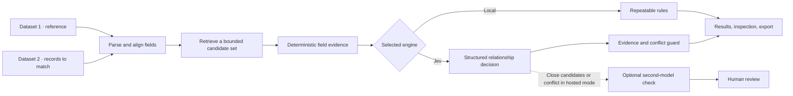

# Match Studio

A local-first workbench for matching records across two datasets. When AI is enabled, **Jev is the primary semantic decision model**; deterministic field evidence stays visible and can block unsupported matches. A second model is reserved for difficult cases in the optional hosted workflow.

## Start locally

Requires Node.js 22 or later.

```sh
npm ci
npm run dev
```

Open the local URL printed by Vite. You can use synthetic examples or import your own data without an account, Docker, API key, or model call. In local mode, files and results stay in the browser session.

For a first run, see the step-by-step [install and use guide](docs/user-guide.md).

## The matching pipeline



Candidate retrieval narrows the search before a model sees anything. Jev classifies each supplied candidate relationship as **equivalent**, **related**, **different**, or **insufficient evidence**. The app then presents that decision alongside independent, deterministic field comparisons. A model confidence value is not a calibrated probability; a deterministic score is not a probability either.

Jev fits this role because TypeSafe describes it as a structured decision model that returns typed choices rather than free-form prose. Match Studio uses that choice format for record identity decisions. The optional [Jev + field-evidence design](docs/matching-architecture.md#why-a-jev-led-hybrid) aims to combine task-specific decisions with reproducible evidence and review gates. It is a strong design hypothesis, not a universal accuracy claim: users should compare models on labeled examples from their own data. See [Jev on OpenRouter](https://openrouter.ai/typesafe/jev-1.13) and [TypeSafe System One](https://docs.typesafe.ai/concepts/system-one).

## What you get

Each Dataset 2 row gets a proposed relationship and, where available, a Dataset 1 candidate. Open a result to inspect:

- **Evidence score (0–100):** a deterministic agreement score from fields, never a correctness probability.
- **Field coverage:** how much of the configured weighted evidence could be compared.
- **Field-by-field evidence:** agreements, partial similarities, missing values, and identity conflicts.
- **Candidate context:** alternatives, score margin over the next candidate, number considered, and whether search was bounded.
- **Outcome lane:** Match, Review, Low confidence, or No match. Ambiguity and conflicts remain reviewable.
- **Model details, when used:** model and provider version, uncalibrated confidence, latency, reported token use and cost, and cache status.

Export row-level decisions and evidence to CSV. On the separate **Compare models** page, an answer key enables accuracy, match precision and recall. The comparison also reports p50/p95 latency, runtime, reported cost, failures, and cached rows. No answer key means those accuracy metrics are not shown.

## Install and use

1. Install Node.js 22+, clone this repository, then run `npm ci` and `npm run dev`.
2. Put the reference data in **Dataset 1** and the records to resolve in **Dataset 2**.
3. Choose the record-name field in both datasets. Optionally choose a shared identifier in both; an identifier mismatch blocks an automatic match.
4. Run with **Local field comparison** for a keyless, deterministic result. Inspect the evidence score and alternatives, resolve the review lane, then export.
5. To use Jev or compare external models, follow [the install and use guide](docs/user-guide.md) to configure your own OpenRouter key and explicitly opt into provider calls.

Supported file uploads: CSV, TSV, delimited TXT, XLSX, JSON, JSONL/NDJSON, and XML. You can also paste cells or structured text, or fetch a public HTTPS link that permits browser CORS access. Limits are 10,000 rows and 20 MB per dataset in the local importer. See [formats and limits](docs/matching-architecture.md#input-formats-and-limits).

## Cost, privacy, and evaluation

Local matching makes no provider or hosted-service requests. AI calls are disabled unless the operator supplies an OpenRouter key and sets `ALLOW_PAID_MODEL_CALLS=true`. Provider prices can change; a missing price is unknown, not free. Calls send selected record fields to the chosen provider and can incur charges. Hosted Supabase, Cloudflare, and Trigger.dev services are optional and require accounts controlled by the operator.

The regular Jev run evaluates every Dataset 2 row with retrieved candidates; it is not capped to a small sample. Start with a small dataset or use the Model comparison page's 5–50 row sample, then estimate cost before processing a larger dataset. The optional hosted live pipeline can also make embedding requests and a second-model request for ambiguous rows.

```sh
npm run evaluate  # local synthetic fixture summary; no model calls
npm run build
npm run test
```

Fixture results are diagnostic only; their small synthetic sample does not establish production accuracy. For a real model comparison, create an answer key from reviewed records and use the same sample for each model.

## Documentation

- [Install and use guide](docs/user-guide.md)
- [Matching architecture, Jev pipeline, metrics, and limits](docs/matching-architecture.md)
- [Optional hosted self-hosting and deployment](docs/self-hosting.md)
- [Publishing checklist](docs/publishing.md)
- [Contributing](CONTRIBUTING.md) · [Security](SECURITY.md)

Match Studio is MIT-licensed; see [LICENSE](LICENSE).
