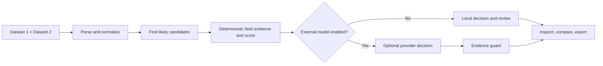

# Match Studio

Match Studio compares two tables and shows the evidence behind each suggested relationship. It is designed for review: local rules establish a repeatable baseline, uncertain rows stay visible, and an optional model can help classify difficult candidates.

## Try it locally

Requires Node.js 22 or later.

```sh
npm ci
npm run dev
```

Open the local address printed by Vite. No account, Docker, API key, hosted service, or model call is needed for local matching. Imported records stay in the browser in this mode.

Load one of the synthetic sample cases or add two datasets. Supported files are CSV, TSV, delimited TXT, XLSX, JSON, JSONL / NDJSON, and XML. You can also paste table cells or structured text, or fetch a public HTTPS file link that allows browser CORS access. The app supports up to 10,000 rows and 20 MB per dataset. See [input formats and limits](docs/matching-architecture.md#input-formats-and-limits).

## How it works



Local evidence uses normalized names, selected shared identifiers, and compatible identity fields. A score is an evidence agreement score, not a probability. Conflicting identifiers and ambiguous candidates require review. Details are in [the architecture guide](docs/matching-architecture.md).

## Cost and API keys

**Local matching, the fixture suite, and the evaluation command do not call paid services.** Model calls are disabled unless you set both your own provider key and `ALLOW_PAID_MODEL_CALLS=true`. The model catalogue also stays local while that flag is off.

To try the optional OpenRouter adapter:

1. Copy `.env.example` to `.env.local`.
2. Add your own `OPENROUTER_API_KEY` and set `ALLOW_PAID_MODEL_CALLS=true`.
3. Restart Vite, choose an external model, and review its displayed price before starting.

The key is read by a loopback-only development service and is never a `VITE_` variable or included in the browser bundle. Provider requests send selected record fields and can incur charges. The current external model adapter uses OpenRouter; Jev is available through that adapter when configured. Unknown prices are treated as billable, not free.

Supabase, Cloudflare Workers/R2, and Trigger.dev are optional services for sign-in, saved workspaces, file storage, and durable jobs. Hosted auth and browser API traffic stay off unless `VITE_ENABLE_HOSTED_SERVICES=true`; Worker API routes also require `ALLOW_HOSTED_SERVICES=true`. Their usage and plan limits can incur charges. Local matching does not need them. Use your own project and credentials only when you intend to enable a service. `.env.example` and `.dev.vars.example` contain placeholders, not working credentials.

## Checks

These commands use local fixtures and need no provider key:

```sh
npm run test
npm run evaluate
npm run build
```

`npm run evaluate` reports the local fixture metrics. It makes no model calls, and its small labeled sample is not a production accuracy claim.

## Optional hosted workspace

The hosted path adds Supabase Auth/Postgres, a Cloudflare Worker with Static Assets and R2, and a Trigger.dev task. It is separate from browser-only local mode and must be configured with accounts you control. Start with [self-hosting and deployment](docs/self-hosting.md); set the paid-model opt-in only if you intend to send records to a provider.

## Repository map

- `src/lib/`: parsing, normalization, deterministic scoring, candidate retrieval, comparison metrics, and API clients.
- `src/components/`: dataset inputs, matching flow, record inspector, and model comparison UI.
- `apps/api/`: authenticated Worker routes and the optional server-side model adapter.
- `trigger/`: optional durable import task.
- `supabase/`: schema migrations, seed data, and database tests.
- `fixtures/`: synthetic input data and expected mappings.
- `docs/matching-architecture.md`: data flow, score policy, privacy boundaries, and limits.
- `docs/self-hosting.md`: opt-in service setup.
- `CONTRIBUTING.md` and `SECURITY.md`: contribution and private vulnerability reporting guidance.
- `docs/publishing.md`: license, secret review, and first-push checklist.

## Publishing

The repository uses the MIT License. See [the GitHub publishing checklist](docs/publishing.md) for release steps and secret-safety checks.
