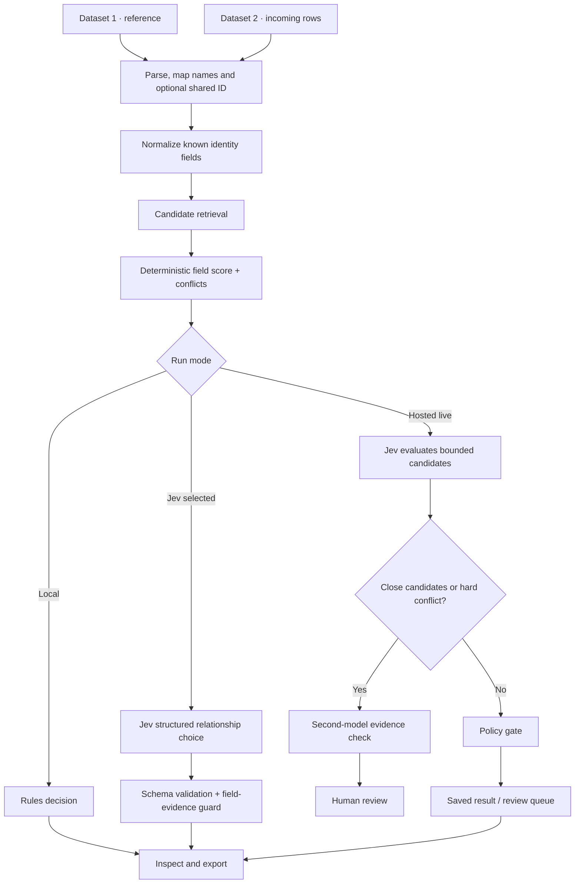

# Matching architecture

Match Studio keeps candidate discovery, field evidence, semantic judgment, and approval policy as separate steps. This lets a reviewer see what each part contributed instead of receiving a bare yes/no answer.

## Two ways to run a comparison

### Browser-local workflow

This is the default and requires no account or API key. The browser parses both datasets, normalizes comparable values, retrieves likely candidates, calculates a deterministic evidence score, and places each Dataset 2 row into a result lane. Nothing is sent to an AI provider or hosted service.

### Jev-assisted workflow

There are two optional Jev entry points:

- **Direct model choice:** select Jev in the matching-engine selector after enabling the OpenRouter bridge. Jev evaluates the bounded candidates for Dataset 2 rows. The UI keeps the model outcome separate from deterministic evidence and can downgrade a proposed equivalent match to review when its evidence guard fails.
- **Saved hosted run:** sign-in, Supabase, a Cloudflare Worker, and Trigger.dev persist datasets, progress events, decisions, and review items. In `MODEL_ADAPTER_MODE=live`, the job retrieves candidates and asks Jev to judge their relationships. The default deployment adapter is `test`, which makes no provider inference; enabling live inference requires the explicit paid-call flag and an operator-supplied provider key.

Model comparison is a separate workflow: it runs selected engines over the same reproducible sample so users can measure differences rather than mixing a benchmark into the normal matching run.

## Why a Jev-led hybrid can work well

TypeSafe describes Jev as a System One model for fast structured decisions, returning a typed choice rather than generated prose. That output shape fits the core semantic question here: are two records equivalent, related, different, or too ambiguous to call? Match Studio asks for that relationship explicitly and validates the returned outcome and candidate IDs. See [TypeSafe's System One overview](https://docs.typesafe.ai/concepts/system-one) and [Jev 1.13 on OpenRouter](https://openrouter.ai/typesafe/jev-1.13).

The surrounding pipeline is designed to make model use more disciplined:

1. **Search first.** Exact identifiers, normalized names, lexical signals, and—on the hosted path when configured—semantic embeddings narrow the reference dataset to a bounded set. A model does not compare every possible pair.
2. **Measure evidence independently.** Repeatable field rules calculate agreements, coverage, alternatives, and conflicts. Those values do not inherit the model's confidence.
3. **Ask Jev a bounded classification question.** The hosted task batches candidate-pair choices for one incoming record into one request; the direct model-comparison path sends up to eight candidates for a row.
4. **Escalate only ambiguity in the hosted live path.** When the top retrieval candidates are close or a hard identity conflict exists, a second schema-constrained model checks up to three candidates and cites the fields it used. This is currently configurable with `ASTRA_MODEL` and defaults to `openai/gpt-6-astra`. Escalated records remain in human review; escalation does not silently authorize a link.
5. **Measure before approving.** The comparison page can run Jev beside other compatible OpenRouter models on the same sample. An answer key supplies the evidence needed to compare accuracy, precision, and recall on a user's own task.

This combination can be a strong fit when structured decisions, transparent evidence, and a review queue matter. It does not prove Jev or the hybrid is the best model for every dataset. Measure retrieval misses, false matches, quality, latency, and cost against representative labeled data before relying on it. The optional second pass may add cost; this project does not promise a lowest-cost or highest-accuracy winner automatically.

## Pipeline detail

The hosted path uses tenant-scoped Supabase records and row-level security, private R2 objects, authenticated Worker routes, and a Trigger.dev task for durable processing and progress events. These are optional operator-owned services, not prerequisites for a local comparison.

## Candidate retrieval and limits

The local index uses exact selected IDs, normalized names, name tokens, known identity blocking keys, and character n-grams to produce candidates. It retrieves at most 128 rows and fully scores at most 24 for each Dataset 2 row. The direct model comparison sees no more than the first eight scored candidates. The hosted retrieval limit is a workspace policy; its default is 20, and it can use exact, trigram, full-text, and vector similarity where embeddings are available.

A candidate outside the retrieved set cannot be selected by the model. A limited search or an absent candidate is not proof that no match exists. The UI exposes search-limited context where the local scorer has it.

## Record evidence score

`record-evidence-v1` is deterministic for a fixed pair of records, field mapping, and code version. It is an **agreement score from 0 to 100**, not a probability of correctness.

- The score is the weighted sum of field agreement contributions divided by the total configured field weight, multiplied by 100 and rounded.
- The record-name comparison has weight 30; an optional selected shared identifier has weight 40. Known identity attributes have defined weights; compatible unknown fields contribute less.
- Exact normalization and supported measurement-unit conversions can count as agreement. Text resemblance can contribute partial agreement for some non-blocking attributes.
- Missing values contribute no agreement. **Coverage** reports the share of configured evidence weight that could be compared.
- A name-only score is capped at 65. Blocking identity conflicts cap it at 49; a conflicting selected shared ID caps it at 25.
- Operational details such as stock, price, or source row lineage are excluded from identity evidence.

The browser-local automatic-match guard normally requires at least 85 points, at least 75% coverage, identifying evidence, no blocking conflict, and an 8-point lead if another candidate exists. A unique exact selected identifier can qualify on its own. Repeated names and truncated exact groups remain reviewable. In the direct model path, an `equivalent` choice is vetoed to `insufficient_evidence` unless this independent guard allows it.

The hosted Jev workflow uses a separate policy based on Jev's outcome probabilities, winner margin, retrieval ranking, and hard identifier contradictions. Automatic linking is off by default and additionally requires an operator-approved exact model version. A second-model escalation always leaves the row in the human review queue.

## Outcomes and what a reviewer sees

For a local or direct-model result, each incoming row can land in:

| Lane | Meaning |
| --- | --- |
| **Match** | A unique equivalent candidate cleared the relevant evidence rules. |
| **Review** | Candidates are ambiguous, important fields are missing, or the model judgment did not clear the guard. |
| **Low confidence** | Retrieved candidates have little supporting evidence. |
| **No match** | No candidate was found, or the evidence supports a different identity. This is not proof a match is absent from an incomplete/limited search. |

The record inspector shows the proposed candidate, field score, coverage, number of identity conflicts, score margin to the next candidate, candidate alternatives, and whether retrieval was limited. Model-assisted rows add the model outcome, uncalibrated model confidence, resolved model/provider, response time, reported cost, cache state, and run fingerprint. CSV export includes the score version and field evidence JSON.

The saved hosted workflow persists a relationship outcome (`equivalent`, `related`, `different`, `insufficient_evidence`, or `unmatched`), model probabilities/confidence, model version, evidence references for escalated decisions, latency/token/cost usage when returned, review status, and human overrides. Automatic linking remains disabled by default.

## Model comparison and metrics

The comparison page can run local rules, Jev, and compatible structured-output OpenRouter models against the same deterministic sample of 5, 10, 25, or 50 Dataset 2 rows. It records the requested and resolved model, provider, settings, dataset and candidate fingerprints, per-row outcomes, reported confidence, latency, token use, provider-reported cost, response-cache state, and errors. Models are not promised to be bit-for-bit reproducible; provider routing and upstream versions can change.

With a labeled answer key, the comparison reports:

| Metric | Meaning |
| --- | --- |
| **Accuracy** | Share of labeled sampled rows whose relation and, for matches, target record are correct. |
| **Precision** | Correct matches divided by predicted matches. A useful view of false-positive risk. |
| **Recall** | Correct matches divided by known matches. A useful view of missed matches. |
| **Label coverage** | Share of the sample that has a human answer-key label. |
| **p50 / p95 latency** | Median and 95th-percentile successful, uncached per-row model time; for the Local option, this is local computation time. |
| **Reported cost** | Provider-reported spend for the evaluated requests; shown as unknown if the provider does not return a cost. |
| **Failures and cached rows** | Failed/skipped requests and responses reused from cache, shown separately from fresh inference. |

For model-version approval workflows, labeled evaluations also track candidate recall and false equivalent predictions. Do not compare models with unlabeled output as though it were measured accuracy. Model confidence values are uncalibrated until separately calibrated against a sufficiently representative labeled set.

## Input formats and limits

Each dataset is parsed independently.

| Input | Formats |
| --- | --- |
| File upload | CSV, TSV, delimited TXT, XLSX, JSON, JSONL/NDJSON, XML |
| Paste | Spreadsheet cells, CSV, TSV, JSON, JSONL, XML |
| Link | Public HTTPS file/API response with browser CORS access |

CSV and spreadsheet headers must be unique. JSON accepts an object, an array, or an array under common keys such as `records`, `data`, `results`, `items`, or `rows`. Nested JSON and XML fields are flattened into dotted names. XML DTDs and custom entities are rejected. XLSX formulas need cached values.

The local importer allows 10,000 rows and 20 MB per dataset, up to 250 fields, 240 characters per field name, and 20,000 characters per cell. Hosted matching has a 20 MB combined normalized-JSON request limit. Legacy `.xls`, `.xlsb`, macro-enabled `.xlsm`, `.xlm`, ODS, Parquet/Arrow/Feather, database files, YAML, PDFs, and images need conversion or extraction first. **`.xlm` is a legacy Excel macro-sheet format, not XML.**

## Cost and data handling

The repo defaults to the local-only, no-key path:

- Paid model requests require both `OPENROUTER_API_KEY` and `ALLOW_PAID_MODEL_CALLS=true`.
- Direct model matching sends selected Dataset 2 rows and their bounded candidate records through the local server bridge to OpenRouter. Only choose this after deciding those fields may leave the device and reviewing provider pricing.
- The normal Jev run evaluates every Dataset 2 row with retrieved candidates; it is not capped to a small sample. The separate model-comparison screen caps its reproducible sample at 50 incoming rows per model. Start there or with a small dataset before scaling up.
- The hosted workflow sends datasets to the operator's Supabase/Cloudflare services. Live Jev and second-model calls require an OpenRouter key in the Trigger environment and the same explicit paid-call opt-in. In live mode, the task can also embed incoming rows in batches of up to 100 when there is no selected reference dataset; embedding usage is provider-billable too.
- The second model currently defaults to `openai/gpt-6-astra`, which is not presented as a cost-optimized choice. Operators can set `ASTRA_MODEL` to a structured-output-capable alternative, then evaluate quality and spend on their own labeled data.
- Supabase/Cloudflare/Trigger stay off in browser-only mode. Hosted routes also require `ALLOW_HOSTED_SERVICES=true`.
- A missing or stale model price is unknown, not free. Set provider-side spend limits; local cost displays cannot enforce them.

Never put secrets in `VITE_*` variables or commit `.env.local`/`.dev.vars`. See [self-hosting](self-hosting.md) for the optional authenticated setup and [the user guide](user-guide.md) for the smallest safe path to try Jev.

## Code map

- `src/lib/dataset-input.ts`: local format parsing and input bounds.
- `src/lib/record-scoring.ts`: normalization, weighted evidence, coverage, and conflicts.
- `src/lib/dataset-comparison.ts`: local retrieval, scoring, decision lanes, and evidence guard.
- `src/lib/benchmark.ts`: labeled sample and comparison metrics.
- `src/lib/model-comparison.ts` and `src/lib/model-evaluation.ts`: model run records and approval metrics.
- `apps/api/src/matching-models.ts`: OpenRouter catalogue, Jev/LLM adapters, schema validation, cache, and direct evidence guard.
- `trigger/tasks/process-vendor-import.ts`: optional durable Jev run and selective second-model escalation.
- `apps/api/`, `trigger/`, and `supabase/`: optional authenticated service boundaries, durable task, schema, and tenant policies.

## Evaluation boundaries

`npm run evaluate` measures only a small synthetic local fixture. It makes no provider calls and is not evidence of real-dataset accuracy. `npm run db:test` needs local Supabase and Docker. A meaningful model assessment needs reviewed labels that represent the real record types, positive and negative matches, duplicates, conflicts, and missing data.
