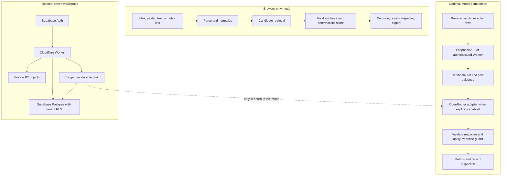

# Architecture and matching policy

Match Studio has a browser-only path and an optional hosted path. The local path is the default: it parses files in the browser, runs deterministic comparison rules, and keeps the imported rows and results in the current session.

## Data flow

The answer key for model comparison remains in the browser. It is used to calculate benchmark metrics and is not sent to a model. A selected provider sees only the sampled incoming rows and bounded candidates needed for that run.

## Input formats and limits

Each dataset is parsed independently. Supported inputs are:

| Method | Formats |
| --- | --- |
| File upload | CSV, TSV, delimited TXT, XLSX, JSON, JSONL / NDJSON, XML |
| Paste | Spreadsheet cells, CSV, TSV, JSON, JSONL, XML |
| Link | Public HTTPS file/API response that allows browser CORS access |

Links are fetched once, without credentials or scheduled refresh. CSV and spreadsheet headers must be unique. JSON can be an object, an array, or an array under common keys such as `records` or `items`. Nested JSON/XML fields become dotted column names. XML DTDs and custom entities are rejected. XLSX formulas must already contain cached values.

Limits are 10,000 rows and 20 MB per dataset, 250 fields, 240 characters per field name, and 20,000 characters per cell. Hosted requests also have a 20 MB combined normalized JSON limit. `.xls`, macro-enabled workbooks, ODS, Parquet, database files, PDFs, and images need conversion or extraction first.

## Deterministic evidence score

`record-evidence-v1` is stable for the same inputs, mapping, and code version. It is an agreement score from 0–100, not a probability.

- Available weighted field evidence is summed and divided by the available field weights, then multiplied by 100 and rounded.
- Names have weight 30; a selected shared identifier has weight 40. Known identity attributes have explicit weights; compatible unrecognized shared fields contribute less.
- Missing values add no evidence. Coverage reports the portion of configured evidence that could be compared.
- Supported numeric units are normalized before comparison. Operational fields such as price, stock, and row lineage are excluded.
- A score without corroborating agreement is capped at 65. Blocking identity conflicts cap it at 49; a conflicting selected shared identifier caps it at 25.
- Automatic acceptance requires at least 85 points, 75% coverage, identifying evidence, no blocking conflict, and an 8-point lead over a competing candidate. Duplicate and truncated exact groups remain reviewable.

Candidate retrieval is bounded to 128 records. Up to 24 candidates receive full deterministic assessment; at most 8 candidates go to a model. A candidate not retrieved is not proof that no match exists. Model decisions cannot override blocking conflicts or the shared evidence guard.

## Model and comparison path

The local rules model is always available and makes no provider request. The optional model comparison currently uses an OpenRouter adapter for Jev and compatible structured-output text models. It supports a sample of 5, 10, 25, or 50 incoming rows per model. Each run records requested and resolved model, provider, outcome, confidence, latency, token use, reported cost, cache state, and dataset fingerprints when available.

For external models, responses are validated against a strict schema and candidate selection is limited to the supplied indices. Provider fallbacks are disabled. Fixed settings and response caching improve comparability but do not guarantee identical model outputs; upstream aliases and deployments can change.

Reported model confidence is not calibrated. Accuracy and precision/recall appear only when the user provides labeled examples. A small benchmark is diagnostic evidence, not a production accuracy guarantee. Cost stays `Unknown` if the provider does not report it.

## Default cost controls and bring-your-own-key

The default configuration is local-only:

- The browser comparison and model catalogue use only the local development bridge; they need no cloud account or provider request.
- Existing Supabase credentials are ignored unless `VITE_ENABLE_HOSTED_SERVICES=true`; this also keeps local auth and saved-workspace traffic off by default.
- Worker API and internal task routes return `503` unless `ALLOW_HOSTED_SERVICES=true`, even when server credentials are present.
- The model catalogue does not contact OpenRouter while `ALLOW_PAID_MODEL_CALLS` is unset or false.
- The local server reads an OpenRouter key only on the server side, and only uses it when the same explicit flag is `true`.
- The durable Trigger task defaults to `MODEL_ADAPTER_MODE=test`. Live model inference requires `MODEL_ADAPTER_MODE=live`, `ALLOW_PAID_MODEL_CALLS=true`, and a key in the Trigger environment.
- The model comparison page starts with Local selected and no external model selected.

To use an external model, a clone owner puts their own `OPENROUTER_API_KEY` in ignored `.env.local`, sets `ALLOW_PAID_MODEL_CALLS=true`, restarts the server, and chooses a priced model. Never put provider keys in `VITE_*` variables. OpenRouter calls can cost money; listed prices and provider policies can change. Set provider spending limits separately.

The hosted path is also opt-in. Supabase, Cloudflare Workers/R2, and Trigger.dev require accounts and credentials controlled by the operator. They may charge for usage or plan upgrades; their free allowances do not guarantee a $0 bill. Trigger runs can be billable even with the deterministic test adapter. Do not deploy a public workspace with shared production keys unless usage is restricted and monitored.

## Service boundaries

- `src/lib/dataset-input.ts`: input parsing and size/shape validation.
- `src/lib/normalize.ts`, `src/lib/record-scoring.ts`: stable normalization and field evidence.
- `src/lib/dataset-comparison.ts`: candidate retrieval, decision lanes, and automatic-match guard.
- `src/lib/benchmark.ts` and `src/lib/model-evaluation.ts`: answer-key metrics and approval gates.
- `apps/api/src/matching-models.ts`: optional model catalogue and model evaluation API. The local Vite middleware accepts loopback requests only.
- `apps/api/src/index.ts`: optional authenticated Worker API.
- `trigger/tasks/process-vendor-import.ts`: optional durable parsing and matching task. The task's historical database table names still use `vendor_*` naming.
- `supabase/migrations/`: tenant-owned records, paired datasets, row results, and access policies.

The browser Supabase anon key is public by design and is constrained by Auth and row-level security. The Supabase service-role key, Trigger key, internal job secret, and provider key stay in server environments. R2 object paths are tenant-prefixed and protected by the Worker.

## Test and evaluation boundaries

`npm run test` runs parser, local scoring, API validation, and database-oriented unit tests without provider credentials. `npm run evaluate` runs the small synthetic fixture set locally and reports its labels and metrics. `npm run db:test` needs local Supabase and Docker. None of these commands need an OpenRouter key; only a user-started model comparison or an explicitly enabled live durable task can contact a provider.

Fixture results do not certify a model or prove production accuracy. The included stress cases are synthetic examples, and their older result reports should not be treated as measurements of the current scoring version.
